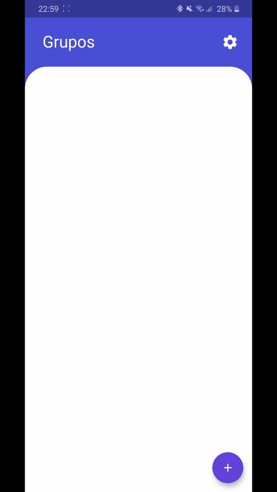

# Meeting App

A Flutter project to connect with your friend using realtime location and realtime messages connected by groups

## Download link 

[Link of Debug APK](https://drive.google.com/file/d/1VlzyS3-oXfBLIkS79l1prCu9RZF2hKsI/view?usp=sharing) (Not real performance)

## Design 
  

## Videos
        
## Resources
- Socket IO.
- MapBox.
- Locator.
- SnackBars.
- Custom Dialogs.
- Error Handling.
- Firebase dynamic links.
- Api Connection.
- Gallery and Photo management.
- Loading screens.
- Session management.
- Provider.
- State management.

